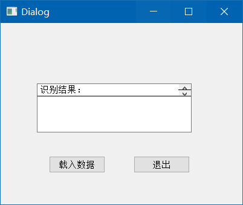
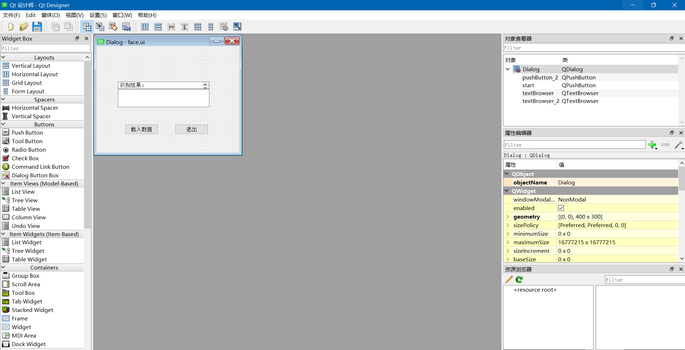

# 电话识别报告


## 主要实现

通过python的```PyQt```实现图形化界面设计和绑定生成。调用```wave```读取波形。调用python的信号处理相关包```numpy，scipy.signal```对信号进行处理。调用```pyinstaller```打包程序。

## ui设计



载入数据选择音频，退出就是退出程序。

## 实现细节

### 设计ui



Qt Designer 提供了现成的ui设计器，直接拖动窗体即可。

### 分割信号

对信号进行滤波和归一化处理后，对信号设置一定的阈值，可以滤去强度不足的杂音。

```python
    for i in range(wave_data.shape[0]):
        if wave_data[i] < 0.15 * nor:
            wavetr[i] = 0
        else:
            wavetr[i] = 1 
```

按照一段一段扫描信号，只有在段中有强度值达到一定阈值的才会被认为是稳定的电话拨号，而不是强干扰的短暂噪音。

```python
    num = (int)(framerate / 40)
    rightend = wavetr.shape[0] - 2 * num
    left = []
    threshold = 43
    key = [0]
    j = 0


    while j <= rightend:
        test = 0
        for i in np.arange(j, num + j):
            test += np.abs(wavetr[i])

        if test > threshold:
            key.append(1)
        else:
            key.append(0)
        if key[-1] > key[-2]:
            left.append(j + (int)(num / 2))
        j += num
```

### fft分析

对分割好的信号进行1024点的fft，得到的结果和表格进行对比，找出偏差不过大的信号

```python
       def fft_deal(self, data, num, framerate, left0):
        f = []
        treatdata = data[left0 - 512:left0 + 511].copy()
        # b,a =signal.butter(4,[500/framerate,1800/framerate],'bandpass')
        # treatdata=signal.filtfilt(b,a,treatdata)
        fftx = np.fft.fft(treatdata, 1024)
        fftx = np.fft.fftshift(fftx)
        absfft = np.abs(fftx) / 1024
        for i in range(10):
            arg = np.argmax(absfft)
            id = True
            temp = -framerate / 2 + (arg) * framerate / 1024
            for i in range(len(f)):
                if np.abs(temp - f[i]) < 50:
                    id = False
            if id:
                f.append(temp)
            absfft[arg] = 0
        f = np.abs(np.array(f))
        f = np.sort(np.unique(f))

        for i in range(len(database)):
            if np.abs(f[0] - LowFreq[i]) < 70:
                if np.abs(f[1] - HighFreq[i]) < 70:
                    return database[i]
```
